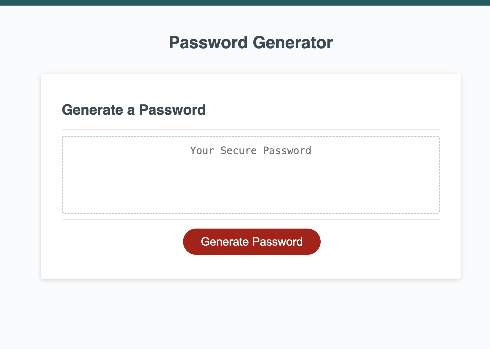

# Password Generator

A simple web-based password generator that allows users to generate secure passwords based on their preferences.

## Description

The Password Generator is a web application that enables users to create strong and secure passwords with various customization options.

## Usage

To use the Password Generator, follow these steps:

1. Open the `index.html` file in your web browser.
2. Click the "Generate Password" button.

3. Enter the desired length of the password when prompted (between 8 and 128 characters).
4. Choose the character types to include (special characters, numerals, lowercase letters, and/or uppercase letters).
5. Your secure password will be generated and displayed in the designated area.

## How it Works

The password generation is based on user preferences, allowing them to select the length and character types for their password. The length can be between 8-128 characters, and the character types include lowercase letters, uppercase letters, numerals, and special characteres. The generator then combines the selected character sets and randomly selects characters to create a strong and secure password.

## Installation

No installation is required. Simply open the `index.html` file in your preferred web browser.

## Technologies Used

This project was built using HTML, CSS, and JavaScript.

## Contributing

Contributions are welcome! If you'd like to contribute to this project, please fork the repository and submit pull requests.

### Guidelines for Contributing

- Fork the repository.
- Create a new branch.
- Make your changes and test thoroughly.
- Submit a pull request with a clear description of your changes.

## Authors

Bradley Troll, bradleytroll@gmail.com

